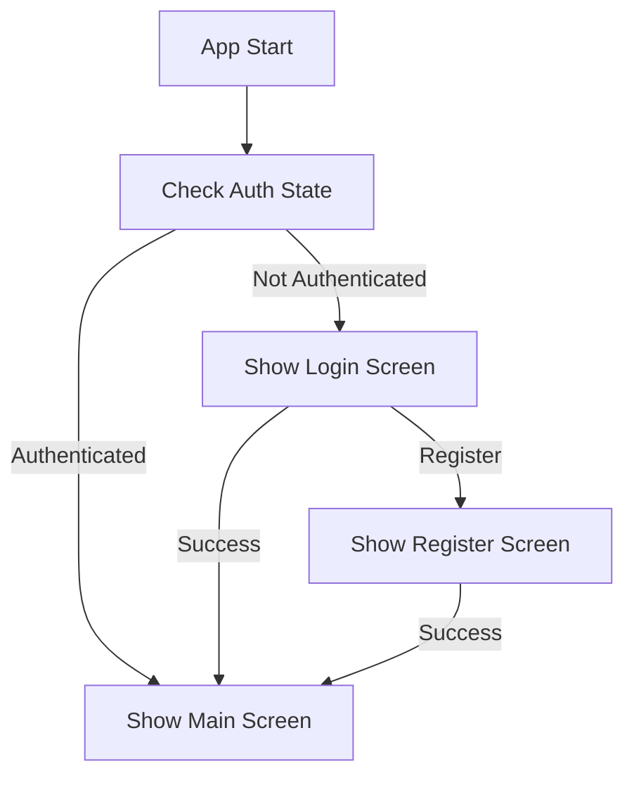
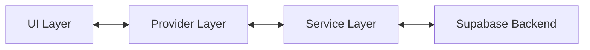
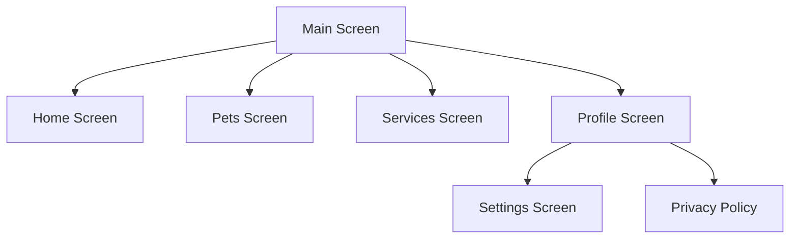
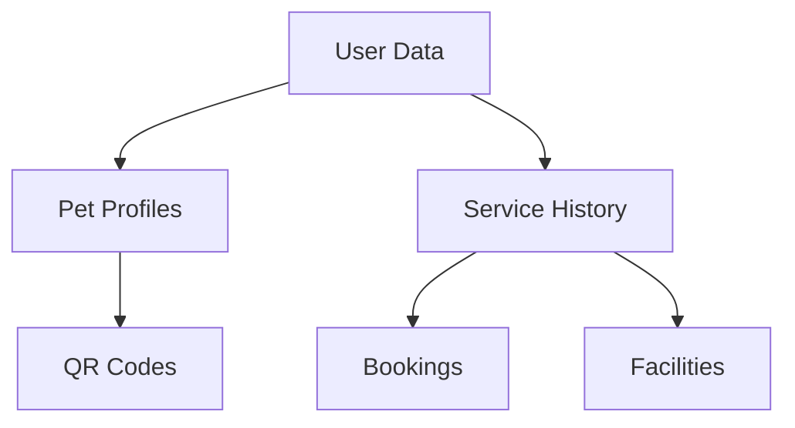

# Pet Care App System Patterns

## Architecture Overview

### Project Structure
```
lib/
├── components/    # Reusable UI components
├── config/        # App configuration and theme
├── l10n/         # Localization resources
├── models/       # Data models
├── providers/    # State management
├── screens/      # UI screens
├── services/     # Business logic and API
├── utils/        # Utility functions
└── widgets/      # Common widgets
```

## Key Design Patterns

### State Management
- Provider pattern for app-wide state
- ChangeNotifier for reactive updates
- Consumer widgets for efficient rebuilds
- Stateful widgets for local state

### Authentication Flow


### Data Flow


## Technical Patterns

### Authentication
- PKCE flow for secure OAuth
- Persistent session management
- Secure token storage
- Multiple auth providers support

### State Management
1. Theme Provider
   - Light/dark mode toggle
   - Theme persistence
   - Material 3 color schemes

2. Language Provider
   - Language selection
   - Locale persistence
   - Dynamic translations

3. Auth State
   - Session management
   - User data caching
   - Auth state listeners

### API Integration
1. Supabase Client
   - Singleton pattern
   - Real-time subscriptions
   - Error handling wrapper
   - Retry mechanisms

2. Service Layer
   - Repository pattern
   - Data transformation
   - Cache management
   - Error normalization

### UI Patterns

1. Screen Structure
```dart
class ExampleScreen extends StatefulWidget {
  @override
  State<ExampleScreen> createState() => _ExampleScreenState();
}

class _ExampleScreenState extends State<ExampleScreen> {
  // State variables
  // Lifecycle methods
  // Business logic
  // Build method
}
```

2. Component Structure
```dart
class ReusableComponent extends StatelessWidget {
  final String title;
  final VoidCallback onTap;

  const ReusableComponent({
    Key? key,
    required this.title,
    required this.onTap,
  }) : super(key: key);

  @override
  Widget build(BuildContext context) {
    // Component UI
  }
}
```

### Error Handling
1. User-Facing Errors
```dart
try {
  // Operation
} catch (error) {
  MessageUtils.showMessage(
    context,
    message: _formatErrorMessage(error.toString()),
    type: MessageType.error,
  );
}
```

2. Service Layer Errors
```dart
try {
  // API call
} catch (error) {
  debugPrint('Error: $error');
  rethrow;
}
```

## Component Relationships

### Screen Navigation


### Data Dependencies


## Best Practices

### Code Organization
- Feature-first organization
- Clear separation of concerns
- Consistent naming conventions
- Documentation for complex logic

### Performance
- Lazy loading when possible
- Efficient rebuild strategies
- Image caching
- Response caching

### Security
- Secure storage for sensitive data
- Input validation
- Data encryption
- Session management

### Testing
- Unit tests for business logic
- Widget tests for UI components
- Integration tests for flows
- Error scenario coverage 